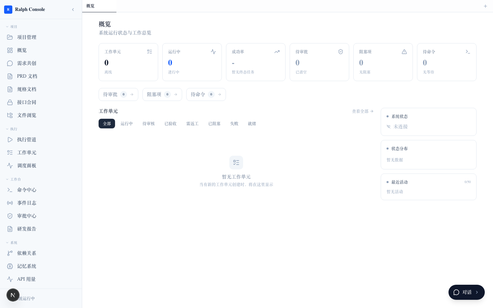
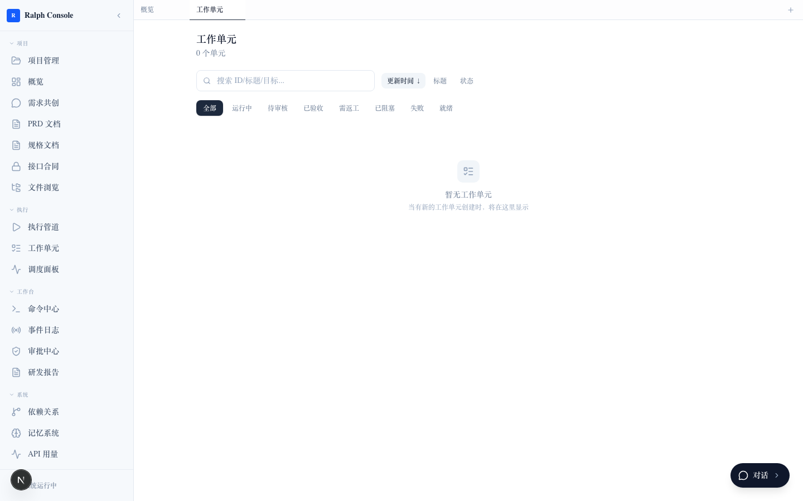
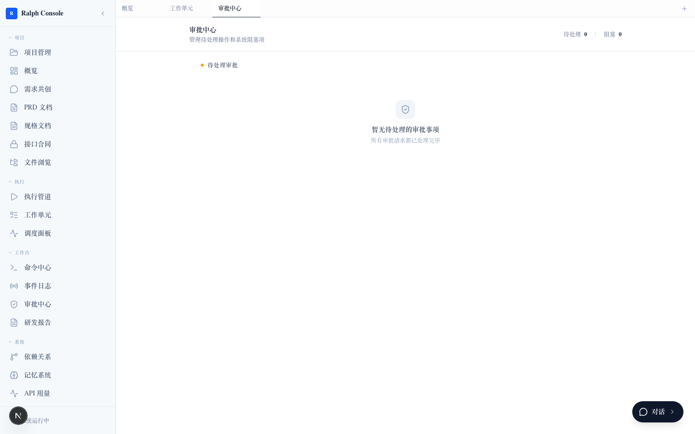
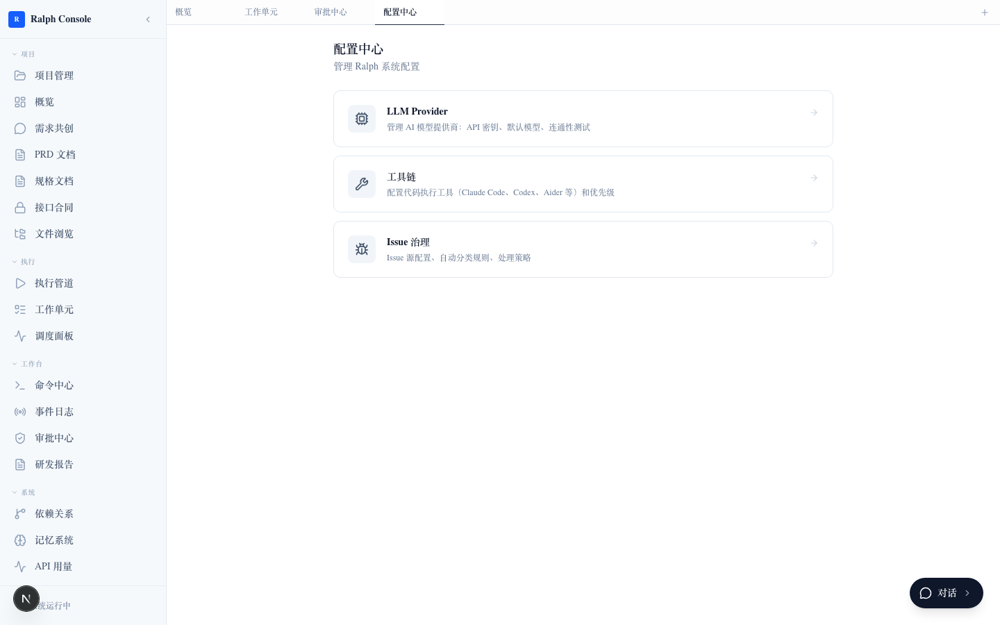

<div align="center">

# ⚡ CodeForge · AI 全自动开发平台

**人类当甲方，AI 干所有活**  
*Humans as clients, AI does all the work*

---

[](https://github.com/hellojoju/codeforge/stargazers)
[](LICENSE)
[](https://python.org)
[](https://nextjs.org)
[](https://fastapi.tiangolo.com)
[](#-ralph-engine)
[](CONTRIBUTING.md)

</div>

---

## 👋 这是什么？

> 说人话：**你说需求，AI 写代码、跑测试、修 Bug，你只管点头或摇头。**

CodeForge 是一个端到端的 AI 驱动软件开发平台。你只需要用自然语言描述想要什么，系统就会：

1. 🧠 **多轮追问**你的需求，直到理解透彻
2. 👨‍💻 **派出 AI 工程师团队**（架构师、后端、前端、QA、安全……）并行干活
3. 🔍 **自动审查代码**，发现问题直接返工
4. ✅ **等你审批**，点头才合并
5. 📊 **实时看板**让你全程围观 AI 干活

不再是你写代码让 AI 补全，而是 **AI 写代码，你当甲方**。**CodeForge**——把你的想法锻造成代码。

---

## ✨ 能做什么？

| 场景 | 以前 | 现在 |
|------|------|------|
| **新项目启动** | 写 PRD → 设计架构 → 搭脚手架 → 编码……折腾几周 | 说一句话，AI 自动产出 PRD + 架构 + 完整代码 |
| **加个功能** | 理解代码库 → 设计实现 → 写代码 → 测试 → 部署 | 说"加个XX功能"，AI 完成全链路 |
| **修 Bug** | 复现 → 定位根因 → 修 → 验证 | AI 自动排查、修复、验证 |
| **Code Review** | 等人 Review → 反复修改 | AI 安全审查 + 代码质量检查并行完成 |
| **多角色协作** | 前端等后端接口、后端等数据库设计，互相阻塞 | 9 个 AI 角色并行工作，接口契约驱动 |

---

## 🖼️ 看看效果

| 概览仪表盘 | 工作单元列表 |
|:---:|:---:|
|  |  |

| 审批中心 | 系统设置 |
|:---:|:---:|
|  |  |

---

## 🚀 3 步上手

### 前置条件

- Python 3.12+
- Node.js 20+
- 一个 [Anthropic API Key](https://console.anthropic.com)

### 1️⃣ 启动后端

```bash
# 安装依赖
uv sync

# 启动 Dashboard 服务
uv run python cli.py dashboard --port 18753
```

### 2️⃣ 启动前端

```bash
cd dashboard-ui
npm install
npm run dev
```

### 3️⃣ 打开浏览器

访问 [http://localhost:3000](http://localhost:3000) —— 看到 Ralph Console 就说明跑起来了。

或者直接用 CLI 模式：

```bash
# 初始化项目（会多轮追问需求）
uv run python cli.py init

# 跑起来
uv run python cli.py run

# 看状态
uv run python cli.py status
```

---

## 🏛️ 架构一览

```
┌─────────────────────────────────────────────────────┐
│                   你（人类甲方）                       │
│  ┌──────────┐  ┌──────────┐  ┌──────────────────┐   │
│  │  CLI/Term │  │ Dashboard│  │ 审批闸门 (Approve)│   │
│  └─────┬────┘  └─────┬────┘  └────────┬─────────┘   │
└────────┼──────────────┼───────────────┼──────────────┘
         ▼              ▼               ▼
┌─────────────────────────────────────────────────────┐
│                  PMCoordinator                        │
│        审批/驳回/暂停/恢复  执行编排                     │
└───────────┬─────────────────────────────┬───────────┘
            │                             │
            ▼                             ▼
┌────────────────────┐   ┌────────────────────────────┐
│   BrainstormManager│──▶│  Feature Tracker           │
│   (多轮需求探索)     │   │  (功能拆解 + 优先级排序)    │
└────────────────────┘   └────────────┬───────────────┘
                                      │
            ┌─────────────────────────┼──────────────┐
            ▼                         ▼              ▼
┌──────────────────┐  ┌──────────────────┐  ┌──────────────────┐
│   Agent Pool      │  │   Agent Pool     │  │   Agent Pool     │
│   🏗️ 架构师      │  │  👨‍💻 后端开发    │  │  🎨 前端开发     │
├──────────────────┤  ├──────────────────┤  ├──────────────────┤
│   🔐 安全工程师  │  │  🗄️ 数据库专家  │  │  🧪 QA 测试     │
├──────────────────┤  ├──────────────────┤  ├──────────────────┤
│   📖 文档工程师  │  │  🎭 UI 设计师   │  │  📋 产品经理    │
└──────────────────┘  └──────────────────┘  └──────────────────┘
         │                      │                      │
         └──────────────────────┼──────────────────────┘
                                ▼
┌──────────────────────────────────────────────────────┐
│                    Ralph Engine                        │
│  ┌──────────┐  ┌──────────┐  ┌──────────────────┐    │
│  │ State    │  │ Repository│  │ WorkUnit Engine   │    │
│  │ Machine  │  │ (原子写入) │  │ (状态机 + 证据)  │    │
│  └──────────┘  └──────────┘  └──────────────────┘    │
│  ┌──────────┐  ┌──────────┐  ┌──────────────────┐    │
│  │ Evidence │  │ Blocker  │  │ Transition Log    │    │
│  │ Collector│  │ Tracker  │  │ (全审计追踪)      │    │
│  └──────────┘  └──────────┘  └──────────────────┘    │
└──────────────────────────────────────────────────────┘
```

### 数据流

```
需求输入 → 多轮追问 → PRD生成 → 功能拆解 → 并行派发
  ↓
Agent执行 → 证据收集 → 自动审查 → 等待审批
  ↓
通过 → 验收测试 → 代码合并 → Git提交
驳回 → 退回重做
```

---

## 🧠 Ralph Engine

Ralph 是 CodeForge 的核心编排引擎，名字来源于"Random Autonomous Leader for Programming Help"。它负责：

### WorkUnit 状态机

```
DRAFT ──▶ READY ──▶ RUNNING ──▶ NEEDS_REVIEW ──▶ ACCEPTED (终态)
                │                │                    ▲
                │                ├──▶ NEEDS_REWORK ───┘
                │                │
                ▼                ▼
             BLOCKED ←──────── FAILED
```

- 每个状态转换都有**角色权限校验**
- 所有转换记录 JSONL **审计日志**
- 支持**强制覆盖**（管理员模式）

### 核心子系统

| 子系统 | 说明 |
|--------|------|
| **WorkUnit Engine** | 状态机驱动的工作单元执行引擎 |
| **Taste Memory** | AI 偏好记忆系统，记住用户风格和偏好 |
| **Prompt Injection Guard** | 双层提示词注入防护（语义级 + 规则级） |
| **Knowledge Graph** | 代码依赖关系图谱 (graphify 集成) |
| **Browser Health Monitor** | 浏览器健康监控与自动重启 |
| **Canary Token** | 数据泄露检测令牌 |
| **Analysis Pipeline** | 分析管道编排 (`/api/ralph/projects/pipeline`) |

### 9 个 AI 角色

| 角色 | 职责 | 并发上限 |
|------|------|---------|
| 🏗️ 架构师 | 系统设计、技术选型 | 1 |
| 👨‍💻 后端开发 | API、业务逻辑 | 3 |
| 🎨 前端开发 | UI、交互 | 3 |
| 🗄️ 数据库专家 | Schema、迁移、优化 | 1 |
| 🧪 QA 测试 | 自动化测试、边界测试 | 1 |
| 🔐 安全工程师 | 安全审查、漏洞扫描 | 1 |
| 🎭 UI 设计师 | 组件设计、视觉风格 | 1 |
| 📖 文档工程师 | 文档、API 参考 | 1 |
| 📋 产品经理 | 需求澄清、PRD 编写 | 1 |

---

## 📋 功能全景

### Ralph Runtime Console (前端)

| 模块 | 页面 | 功能 |
|------|------|------|
| **仪表盘** | `/ralph` | 统计卡片、WorkUnit 列表、系统状态 |
| **执行** | `/ralph/work-units` | 搜索/排序/筛选/分页 WorkUnit 列表 |
| | `/ralph/[id]` | 详情页 + 锚点导航 + 操作栏 |
| | `/ralph/pipeline` | 执行管道可视化 |
| | `/ralph/scheduling` | 调度面板 |
| **工作台** | `/ralph/commands` | 命令中心 |
| | `/ralph/events` | 实时事件流 |
| | `/ralph/approvals` | 审批中心 |
| | `/ralph/reports` | 研发报告 |
| **产品** | `/ralph/brainstorm` | V2 多阶段需求共创（产品定义 → 功能分解 → 关系分析 → 独立审查 → 完成） |
| | `/ralph/prd` | PRD 文档管理 |
| | `/ralph/specs` | 规格文档（CMMI 级功能分解 Spec 生成） |
| | `/ralph/contracts` | 接口合同 |
| **系统** | `/ralph/graph` | 依赖关系 DAG (graphify) |
| | `/ralph/memory` | 记忆系统状态 |
| | `/ralph/files` | 文件浏览器与编辑器 |
| | `/ralph/history` | 执行历史记录 |
| | `/ralph/projects` | 项目管理与分析 |
| | `/ralph/usage` | API 用量统计 |
| | `/ralph/settings/*` | 配置中心（Provider、工具链、Issue 策略、Agent） |

### Dashboard 后端 API

| 端点组 | 数量 | 说明 |
|--------|------|------|
| `GET /api/ralph/*` | 11 | Ralph 只读 API（WorkUnit、Evidence、Review、Blocker） |
| `POST /api/ralph/*` | 3 | Ralph 命令 API |
| `GET /api/dashboard/*` | 6 | Dashboard 状态、模块、审批 |
| `POST /api/*` | 10 | 控制命令（approve/reject/pause/resume/retry/skip） |
| `GET /api/agents/*` | 4 | Agent 管理和状态 |
| `POST /api/execution/*` | 3 | 执行控制（start/stop/status） |
| `WebSocket /ws/dashboard` | 1 | 实时推送 |

---

## 🧠 Brainstorm V2 — 多阶段需求共创

从"聊完就没了"升级为 **CMMI 级功能分解规格生成器**。整个流程分为 5 个阶段：

| Phase | 名称 | 说明 |
|-------|------|------|
| 1 | **产品定义** | 多轮追问明确产品愿景、目标用户、角色、成功标准、MVP 范围 |
| 2 | **功能分解** | 自动拆分功能节点，逐项追问用户故事、验收标准、成功路径 |
| 3 | **关系分析** | 分析功能节点间的依赖关系和冲突 |
| 4 | **独立审查** | 独立 AI 审查器对需求完整性、一致性进行审查 |
| 5 | **完成** | 生成 Spec 文档和任务交接提示，可直接进入开发阶段 |

### V2 核心组件

| 组件 | 文件 | 作用 |
|------|------|------|
| PhaseIndicator | `PhaseIndicator.tsx` | 5 阶段进度指示器 |
| FeatureTreePanel | `FeatureTreePanel.tsx` | 功能树展开/折叠，节点状态展示 |
| NodeDetailCard | `NodeDetailCard.tsx` | 节点详情卡片（用户故事、验收标准等） |
| GranularityBadge | `GranularityBadge.tsx` | 粒度门控检查，显示缺失项 |
| RelationshipGraph | `RelationshipGraph.tsx` | 依赖关系与冲突可视化 |
| SpecPreview | `SpecPreview.tsx` | Markdown 规格文档实时预览 |
| QuestionTracePanel | `QuestionTracePanel.tsx` | 当前追问溯源（节点+字段+原因） |
| TaskHandoffPanel | `TaskHandoffPanel.tsx` | 任务交接提示，下游开发指引 |

---

## 🛡️ 安全性

- **路径遍历防护** — Evidence 文件读取多层校验
- **敏感信息 redaction** — API Key、密码、Token 自动脱敏
- **文件锁冲突检测** — 多 Agent 并发写文件防冲突
- **审批闸门** — 关键操作必须人工确认
- **CORS 配置** — 开发期宽松，生产期可收紧

---

## 🧪 测试

```
前端单元测试:  375 passed, 0 failed  (Vitest)
前端 E2E:      6 spec files            (Playwright)
后端集成测试:  待接入
```

---

## 🛠️ 技术栈

| 层 | 技术 |
|------|--------|
| **运行时** | Python 3.12+ · Node.js 20+ |
| **后端框架** | FastAPI · Uvicorn · Typer |
| **前端框架** | Next.js 16 · React 19 · TypeScript 5 |
| **UI 组件** | Tailwind CSS v4 · shadcn/ui · Lucide Icons |
| **状态管理** | Zustand 5 · Event Sourcing |
| **AI 接口** | Anthropic API · MCP Protocol |
| **数据库** | SQLite · JSON 持久化（原子写入） |
| **自动化** | Playwright |
| **包管理** | uv (Python) · npm (前端) |
| **代码质量** | Ruff · ESLint · Vitest · Playwright |

---

## 📦 项目结构

```
codeforge/
├── cli.py                 # CLI 入口 (Typer + Rich)
├── agents/                # 9 种 AI 角色实现
│   ├── base_agent.py      # Agent 基类
│   ├── pool.py            # Agent 池 + 文件锁
│   └── product_manager.py # PM 角色
├── core/                  # 核心引擎
│   ├── project_manager.py # 项目管理器
│   ├── feature_tracker.py # 功能追踪
│   └── execution_ledger.py# 执行台账
├── ralph/                 # Ralph 编排引擎
│   ├── repository.py      # 统一状态仓库 (JSONL)
│   ├── state_machine.py   # 状态机
│   ├── brainstorm_manager.py # 需求探索
│   ├── command_handler.py # 命令处理
│   └── work_unit_engine.py # 工作单元引擎
├── dashboard/             # FastAPI 后端
│   ├── api/routes.py      # REST + WebSocket
│   ├── coordinator.py     # PM 协同器
│   ├── consumer.py        # 命令消费者
│   └── state_repository.py# 状态仓库
├── dashboard-ui/          # Next.js 前端
│   ├── app/ralph/         # 25 个路由页面
│   ├── lib/               # Store + API + WebSocket
│   └── components/        # UI 组件
├── .ralph/                # 项目运行时数据
│   ├── work_units/        # WorkUnit 持久化
│   ├── features/          # 特性追踪
│   ├── memory/            # 记忆系统
│   ├── knowledge-graph/   # 知识图谱
│   └── config/            # 配置中心
├── tests/                 # 测试
│   ├── *.test.ts(x)       # 前端组件测试
│   ├── ralph/             # Ralph 前端 API 与组件测试
│   └── e2e/               # Playwright E2E
└── docs/                  # 架构文档 & 设计决策
```

---

## 🤝 如何贡献

1. Fork 这个项目
2. 创建你的特性分支 (`git checkout -b feature/amazing`)
3. 提交你的改动 (`git commit -m 'feat: add amazing feature'`)
4. 推送到分支 (`git push origin feature/amazing`)
5. 创建一个 Pull Request

> 我们欢迎任何形式的贡献 —— 提 Issue、修 Bug、加功能、写文档，都行。

---

## 📜 License

[MIT](LICENSE) © 2026

---

## ⭐ Star History

[](https://star-history.com/#hellojoju/codeforge&Date)

---

<div align="center">

**如果这个项目对你有帮助，点个 ⭐ 就是最大的支持**

**Built with ❤️ by Claude Code & Human**

</div>
